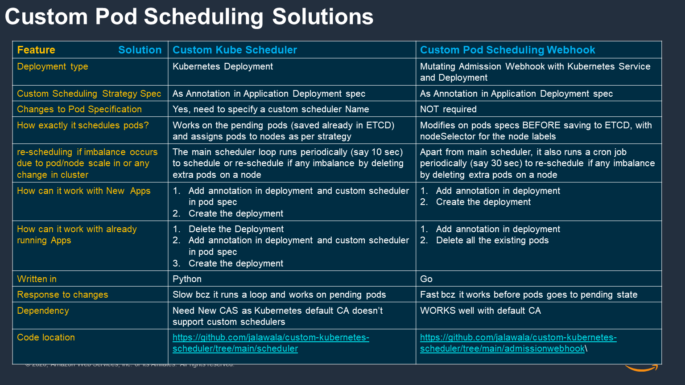

# Custom Pod Scheduling in Kubernetes

## What is this?

It is a solution to spread pods in a given deployment across nodelabels in a given ratio.
This is similar to Amazon ECS capacity provider strategy

## Why do I need this?

Customer asking for a way to distribute pods in a specific ratio across nodes

Similar to Amazon ECS Capacity Provider Strategy with base and weights

Usecases includes
* Spread pods between EC2 Spot and On-demand nodes for cost savings
* Spread pods across AZ for High Availability
* Strict compliance requirements for critical applications  
* Spread pods on any arbitrary node labels with a given weight

 
### Why cant I use existing Kubernetes Scheduling Constructs?

Existing Kubernetes constructs does not provide this natively

Node Pod Affinity / AntiAffinity provides a best effort but doesn’t guarantee

MaxSkew in 1.19 provides a fixed number for difference in pods count

## Custom Pod Scheduling Solutions

* [Kube Pod Scheduler](./scheduler/)
* [Custom Pod Scheduling Mutating Webhook](./admissionwebhook)
